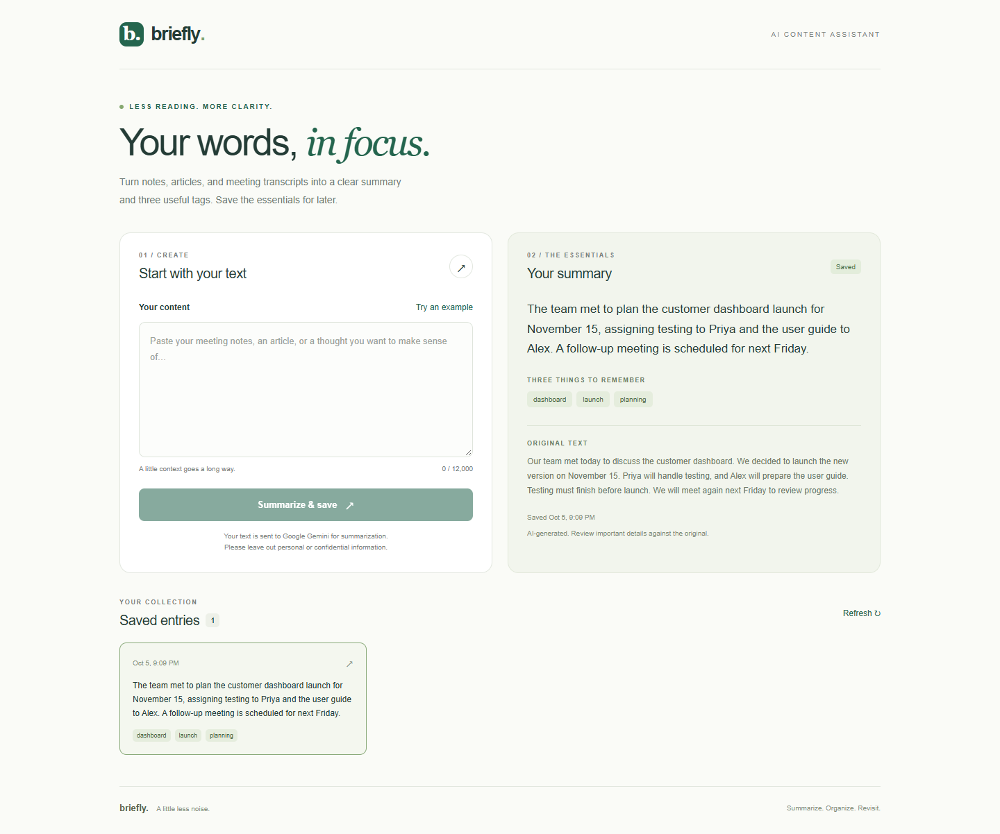

# Briefly — AI Content Assistant

A small Next.js + Node.js application that turns text into a concise summary and exactly three tags, then saves it in SQLite. Node.js is used with the assignment issuer's approval, as confirmed by the candidate.



The screenshot shows a real Gemini result saved in SQLite and loaded through the application.

## Run locally

Requires Node.js 20.9+ and a [Google AI Studio API key](https://aistudio.google.com/apikey). Use a Free Tier project with available model quota; paid billing is not required for eligible free-tier usage.

```sh
npm install
```

Copy `backend/.env.example` to `backend/.env` and set `GEMINI_API_KEY`. On PowerShell: `Copy-Item backend/.env.example backend/.env` (only if `.env` does not already exist). `GEMINI_MODEL` defaults to `gemini-3.5-flash-lite`. Restart the backend after changing `.env`.

```sh
npm run dev
```

Open http://localhost:3000. The API listens on `127.0.0.1:4000`; Next.js proxies `/api/*` to it. SQLite schema and `backend/data/entries.sqlite` are created automatically. Stop with Ctrl+C; saved entries remain after restart. The UI and saved entries work without a key; generating a summary requires one. Credentials and local database files are git-ignored.

```sh
npm test       # API, persistence, validation, and AI error handling; no API key needed
npm run build # Production frontend build
npm start     # Run production frontend + backend after building
```

## API

| Endpoint | Behavior |
| --- | --- |
| `POST /entries` | JSON `{ "text": "Your notes…" }`; validate, summarize, save, return entry (201) |
| `GET /entries` | List saved entries, newest first |
| `GET /entries/:id` | Read one entry; 404 if absent |

An entry has `id`, `originalText`, `summary`, `tags`, and `createdAt`. Errors return `{ "error": "Useful message" }`. Input is limited to 12,000 characters. The browser uses the `/api` prefix.

## Architecture

Next.js renders the form and collection; same-origin requests are proxied to Express.
The entries route validates input, calls the AI service, then writes through a SQLite repository.
The AI service calls Gemini's `generateContent` REST endpoint with a JSON schema using Node's built-in fetch; Zod checks the result and distinct tags before persistence.
SQLite uses prepared statements and a file-backed database that survives restarts.
The UI shows saved summaries, tags, and original text; failed generation preserves the draft.

## AI choice

Google Gemini `gemini-3.5-flash-lite`, configurable through `GEMINI_MODEL`, suits this bounded summarization task and has a [free tier subject to quota](https://ai.google.dev/gemini-api/docs/pricing#gemini-3.5-flash-lite).
It supports [structured JSON output](https://ai.google.dev/gemini-api/docs/generate-content/structured-output), with separate server-side validation before saving.
The prompt asks for 1–3 sentences and three relevant tags, and treats submitted text as data rather than instructions.

## Reliability

Fetch has a 25-second abort timeout and no automatic retries so a slow call returns promptly without consuming extra quota.
Malformed, incomplete, refused, or invalid output returns a useful error; failed generation is never inserted.
Server validation rejects empty/oversized input and requires a nonempty summary and exactly three distinct nonempty tags.
Tests substitute only the external AI boundary; persistence tests use real SQLite and reopen the database.

## Privacy

Only the submitted text and summarization instructions are sent to Google Gemini; existing entries are not sent. The key is sent in a server-side header, never in browser code or URLs.
Google's free tier may use prompts and responses to improve its products; use synthetic sample content for this prototype.
Do not submit customer PII, account details, credentials, or confidential financial records without approved redaction and provider arrangements.
The local database stores text unencrypted; this unauthenticated prototype binds to loopback and should remain local.

## One more day: production next steps

- Add authentication and per-user authorization with data retention/deletion controls.
- Add rate limits and idempotency to control spend and prevent duplicate submissions on retries.
- Add redacted operational logs and a small real-model evaluation set for summary/tag quality.

## AI coding tools

OpenAI Codex assisted with scaffolding, implementation, tests, and documentation.
All 11 backend tests and the production build passed. A real Gemini call verified generation, API create/list/detail, and SQLite persistence after reopening.
Browser checks verified the saved result, three tags, reload persistence, mobile layout, and provider notice; the screenshot uses real output.

## Submission check

- Run the app with your local Gemini key and use **Try an example → Summarize & save**.
- A real generated entry was verified after reopening SQLite and reloading the browser.
- The working screenshot is included at `docs/screenshot.png`. Keep credentials and the local database out of the public repository.

If Gemini reports a quota error, check your project/model limits in [Google AI Studio](https://aistudio.google.com/usage). Free-tier limits vary by model and project. A missing, restricted, or invalid key produces a separate configuration error.
